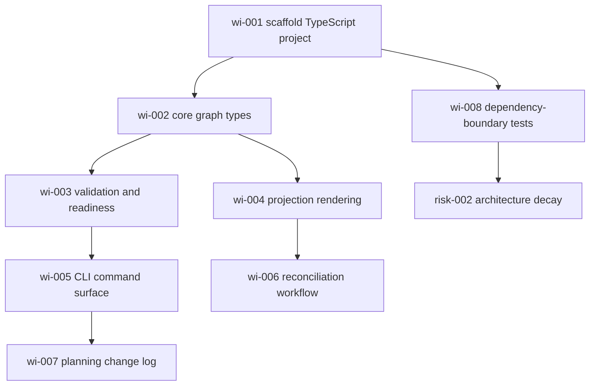

# Dependency View

## Graph Summary

The V1 Planning Graph contains requirements, accepted decisions, assumptions, risks, HITL Gates, components, Work Items, Document Projections, Execution Slices, and Dependency Edges. Work Item scheduling is derived from graph-wide dependencies.

## Readiness After Slice-003 Completion

`slice-001`, `slice-002`, and `slice-003` are complete and validated. All V1 implementation Work Items in this graph are done.

Current readiness:

- `wi-003`: done
- `wi-004`: done
- `wi-005`: done
- `wi-006`: done
- `wi-007`: done

Current dependency order is:

1. `wi-001`: Scaffold TypeScript project and package scripts. Done.
2. `wi-002`: Implement core graph types and stable IDs. Done.
3. `wi-008`: Add dependency-boundary tests. Done.
4. `wi-003`: Implement graph validation and readiness derivation. Done.
5. `wi-004`: Implement projection rendering. Done.
6. `wi-005`: Implement CLI command surface. Done.
7. `wi-006`: Implement graph reconciliation workflow. Done.
8. `wi-007`: Implement planning change log. Done.

## Next Execution Slices

- `slice-001`: Foundation scaffold and graph core. Done.
- `slice-002`: Validation and projection loop. Done.
- `slice-003`: Reconciliation and audit loop. Done.

## Mermaid Diagram

